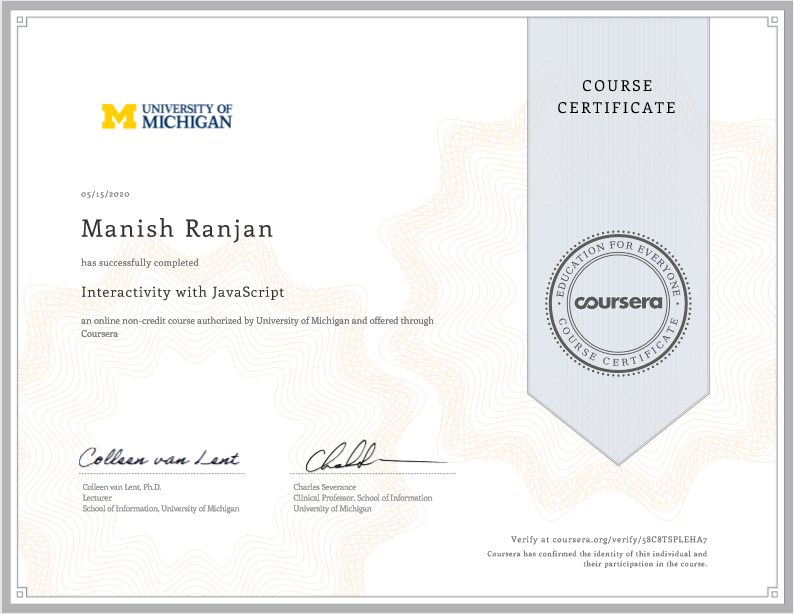

# Interactivity-with-Javascript---Coursera

###### This repository contains all the code of weekly assignments in the course.

## Projects :
- Project-1 - Javascript Interactive Photo gallery
- Project-2 - Autocomplete with Javascript

## Output :
- Project-1 - [Click Here](https://mandivson.github.io/Interactivity-with-Javascript---Coursera/Week%202%20Assignment/)
- Project-2 - [Click Here](https://mandivson.github.io/Interactivity-with-Javascript---Coursera/Week%204%20Assignment/)
